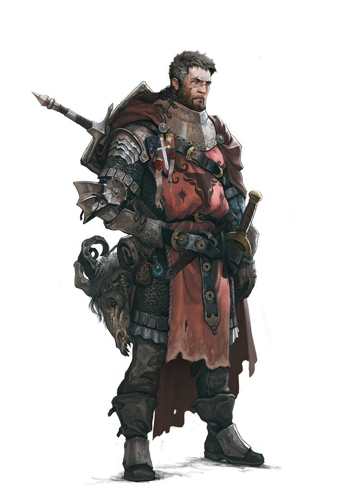
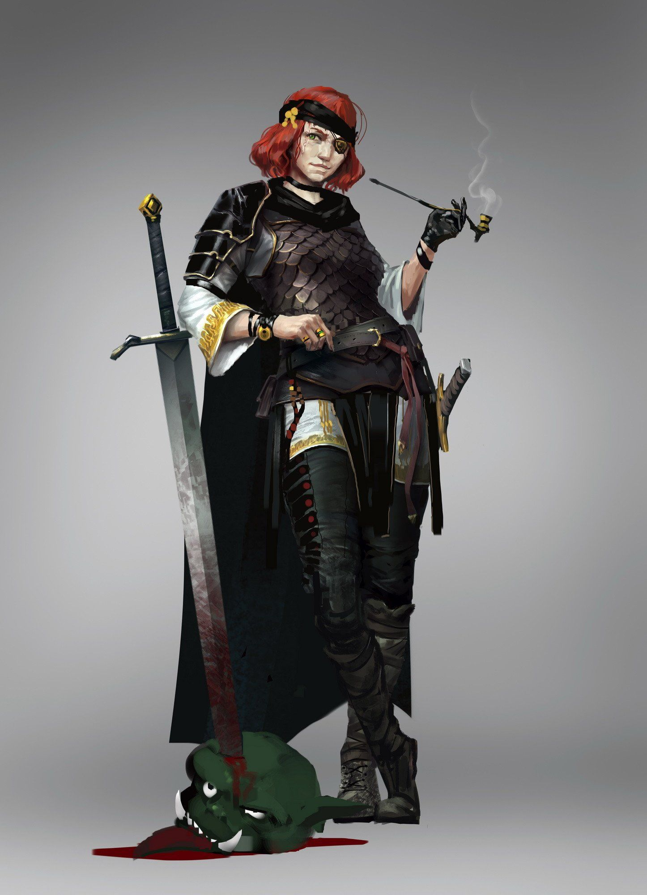
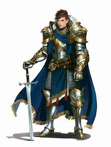
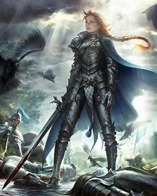
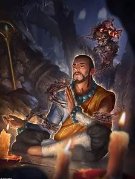
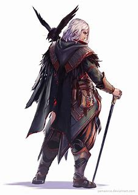
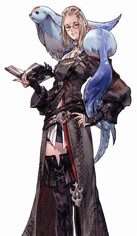
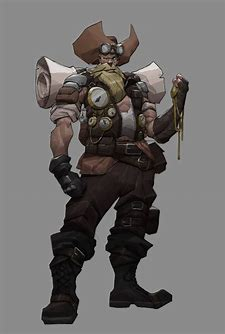
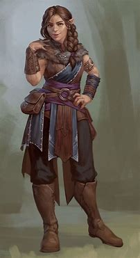
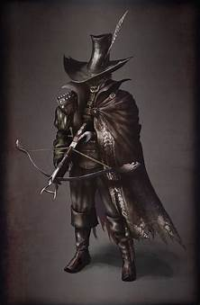

Classes
=======

All classes start with 48 skill points

# Soldier

 

| Stat | Starting Value |
|------|----------------|
| HP   | ??             |
| MP   | ??             |
| STR  | 14             |
| DEX  | 13             |
| ARC  | 8              |
| PER  | 11             |

## Description

Soldiers of fortune come from a variety of places and backgrounds, but they all have one common desire: The Job to end
all Jobs. A payout so great, they can hang up their swords and retire to a life of leisure and luxury.

Usually ex-soldiers themselves, SOF favor close quarters combat, and know how to take a punch. When the SOF heard about
a job in wanderer's rest the had a payout of a literal wish being fulfilled they couldn’t resist

## Class Actions

| Level | Action                    | Description                                                  |
|-------|---------------------------|--------------------------------------------------------------|
| 1     | Walk it off               | Heal for n HP and break any crowd control conditions         |
| 2     | Rally the troops          | Grants the party AC, MC, increased chance to hit for n-turns |
| 3     | Always Ready (Passive)    | Gain +1 to initiative rolls                                  |
| 4     | Cleave                    | Allows you to hit 2 enemies with your melee attack           |
| 5     | Bull Rush                 | Charge an opponent knocking them prone for 1 turn            |
| 6     | Battle Hardened (Passive) | Gain n% chance to hit with weapons                           |

# Paladin

 

| Stat | Starting Value |
|------|----------------|
| HP   | ??             |
| MP   | ??             |
| STR  | 8              |
| DEX  | 13             |
| ARC  | 14             |
| PER  | 11             |

## Description

## Class Actions

| Level | Action | Description |
|-------|--------|-------------|
|       |        |             |

# Occultist

| Stat | Starting Value |
|------|----------------|
| HP   | ??             |
| MP   | ??             |
| STR  | 8              |
| DEX  | 13             |
| ARC  | 14             |
| PER  | 11             |

## Description

## Class Actions

| Level | Action | Description |
|-------|--------|-------------|
|       |        |             |

# Arcanist

  

| Stat | Starting Value |
|------|----------------|
| HP   | ??             |
| MP   | ??             |
| STR  | ??             |
| DEX  | ??             |
| ARC  | ??             |
| PER  | ??             |

## Description

## Class Actions

| Level | Action | Description |
|-------|--------|-------------|
|       |        |             |

# Treasure Hunter

| Stat | Starting Value |
|------|----------------|
| HP   | ??             |
| MP   | ??             |
| STR  | ??             |
| DEX  | ??             |
| ARC  | ??             |
| PER  | ??             |

## Description

## Class Actions

| Level | Action | Description |
|-------|--------|-------------|
|       |        |             |

# Grave Warden

| Stat | Starting Value |
|------|----------------|
| HP   | ??             |
| MP   | ??             |
| STR  | ??             |
| DEX  | ??             |
| ARC  | ??             |
| PER  | ??             |

## Description

## Class Actions

| Level | Action | Description |
|-------|--------|-------------|
|       |        |             |