# Settings and location

## Theme & setting

Grim/Dark with a mask of cuteness over it UwU

# Overview

| Level | Name                    | Description                                                                                                                                                            |
|-------|-------------------------|------------------------------------------------------------------------------------------------------------------------------------------------------------------------|
| 0     | [Ground](#ground)       | Where shops and other player services are.                                                                                                                             |
| 1     | [Limbo](#limbo)         | The tutorial / easy level.                                                                                                                                             |
| 2     | [Lust](#lust)           | Those who gave into sexual desires                                                                                                                                     |
| 3     | [Gluttony](#gluttony)   | Those who overendolged in materal pleasures                                                                                                                            |
| 4     | [Greed](#greed)         | Those who hoarded wealths                                                                                                                                              |
| 5     | [Anger](#Anger)         | Where those who where sullen or wrathfull go                                                                                                                           |
| 6     | [Heresy](#heresy)       | Where those who denied the afterlife / god                                                                                                                             |
| 7     | [Violence](#violence)   | Where those who commited violence go                                                                                                                                   |
| 8     | [Fraud](#fraud)         | Where those who deceved others for personal gain                                                                                                                       |
| 9     | [Treachery](#treachery) | Where those who betrayed there kin, country, guests, or benfacotrs exits. dante encouters a fronzen lake where teh rators are trapped in the ice, being chew by saytan |

# Ground

This is a small village named Wander’s Rest. It is a small, remote village on the edge of the kingdom where it is
rumored
the veil between the natural and supernatural world has been made thin by a misguided cleric.

## Notable Places

- Blacksmith
    - upgrade/repair/buy weapons & armor
- Arcanist
    - A black smith, but for magic stuff. Spells, potions ect.
- Chapel
    - contains the stairwell leading to the dungeon
- Tavern
    - Players can go here to “rest”
        - maybe add a mechanic to get a random buff or debuff after resting at the tavern??

# Limbo

The place that lies between the natural world and the start of heaven/hell and whatever else might be there. In terms
of the game, this is the tutorial area where spirits trapped in limbo offer to teach player(s) the mechanics of the game

- The player doesn’t need to engage with the tutorial, but they do need to clear a boss fight before they can descent
  into hell

## Environment

Despite being in the basement of a chapel, this level takes on the appearance of a misty forest, illuminated by a
mysterious and unseen light source. The air is cold and damp and a gentle breeze always seems to quietly hum in the
background.

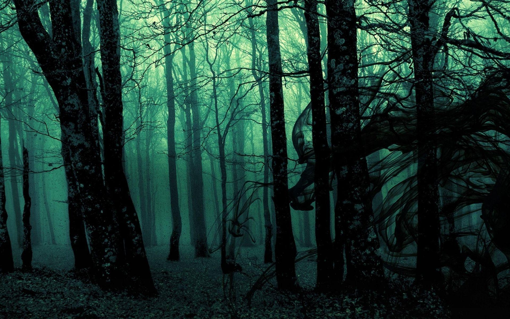

## Notable Places

- The Foot of heaven (Grand, shimmering and gated staircase that ascends upwards to heaven. The player cannot enter this
  path, and if they try they are attacked and killed by angels)
    - 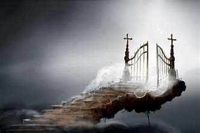]

- The Maw of Hell (A dank, dark and foreboding staircase that descends down into hell. This is the location of the
  tutorial boss fight)
    - 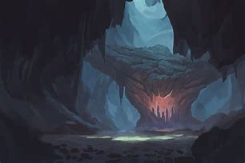

## Inhabitants

Inhabitants in limbo are not hostile (do not attack player on site), minus the boss
99% of the beings on this level are wandering spirits of the dead awaiting a place to go in the afterlife.

- 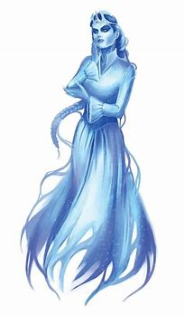
- 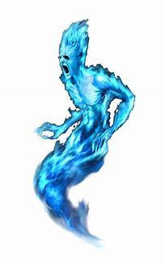
- 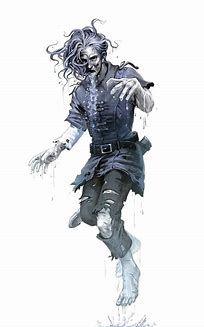

## Boss

Cerberus, Vanguard of the Hell Maw

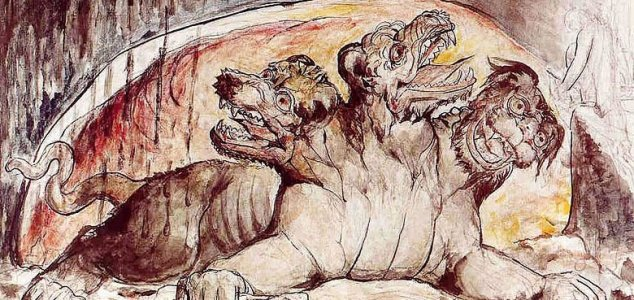

# Lust

Despite being the “2nd” level, this is where our journey into hell actually starts. In this circle of hell, sinners who
give into their sexual desires are kept, their hands and feet chained to walls/posts, ensuring they aren’t able to
fulfill any of their lustful desires. To amplify this torture, the enemies in this area (succubus and incubus) wander
around provocative in an attempt to arouse their prisoners.

## Notable Places

- Lillth's Cheteau

## Boss Battle

- Lilith, Mother of temptation

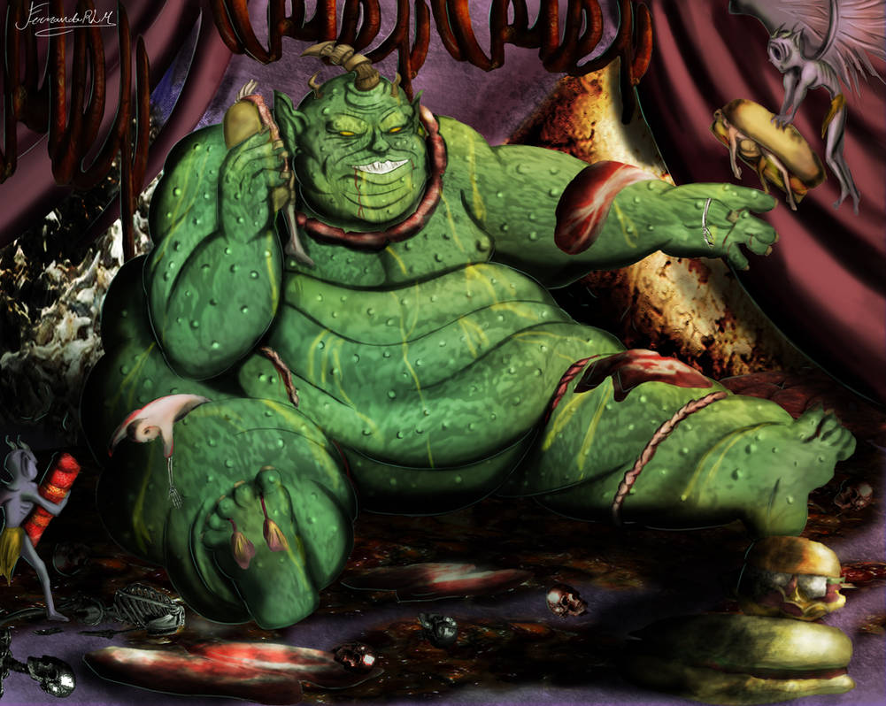

# Gluttony

Like lust, this circle of hell holds those who give into their propensity to overindulge in (non-sexual) pleasures and
delicacies. To punish these sinners, the local demons have littered lumps of clay everywhere, but have enchanted the
clay to look like the food/thing the observer desires most in that moment. Despite knowing this, the sinners are so
starved that they desperately try to eat the enchanted food they find on the ground, only to end up with a mouthful of
mud, and an impossibly empty stomach.

## Notable Places

????

## Boss Battle

Belzebub the Insatiable

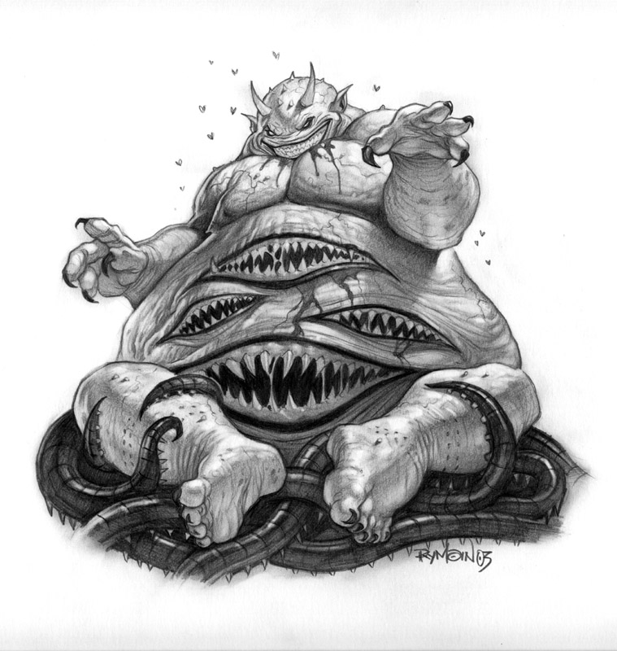

# Greed - TODO

## Notable Places

????

## Boss Battle

Mammon, Purser of Hell
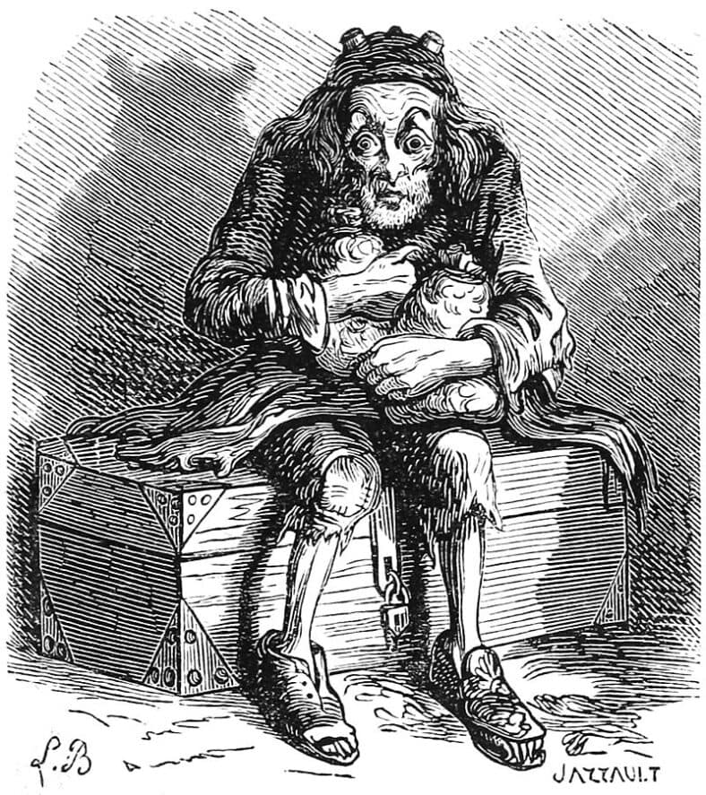

# Anger - TODO

## Notable Places

????

## Boss Battle

???

# Heresy - TODO

## Notable Places

????

## Boss Battle

Pazuzu, Lord of Heretics
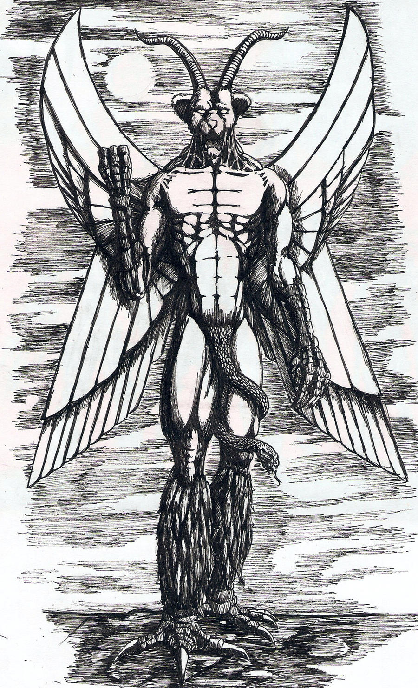
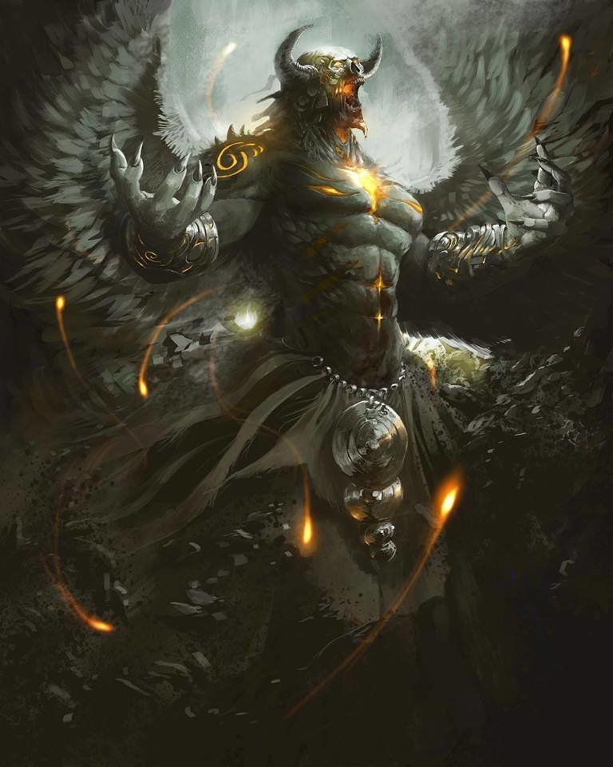

# Violence - TODO

## Notable Places

????

## Boss Battle

Valak, General of the Hells
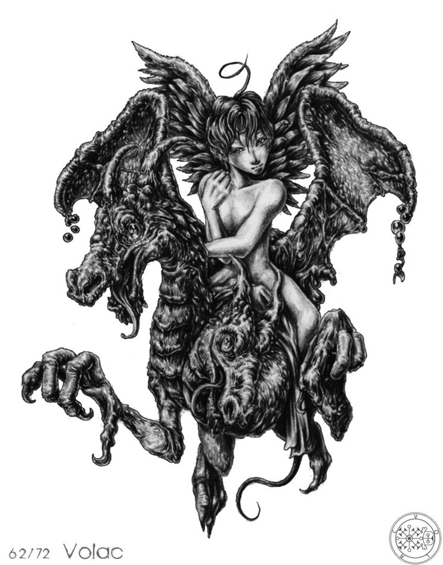
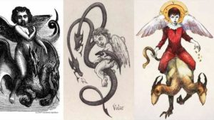

# Fraud - TODO

## Notable Places

????

## Boss Battle

Valak, General of the Hells

# Treachery - TODO

## Notable Places

????

## Boss Battle

Valak, General of the Hells

# EndGame - TODO